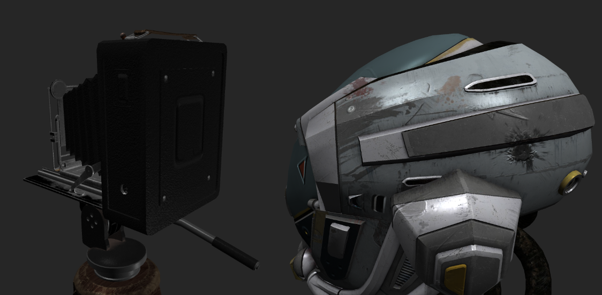

# Kenoma Engine

## A real-time graphics engine built with C++ and OpenGL.

Libraries used: glfw, glad, dear imgui, spdlog tracy, cgltf, stbi

**Current features:**
- gltf model loading and processing
- texture loading and processing
- Phong lighting (point, directional and spot lights)
- Normal maps
- Real-time renderer with camera controls
- More features coming soon!

special thanks to learnopengl.com and deccer